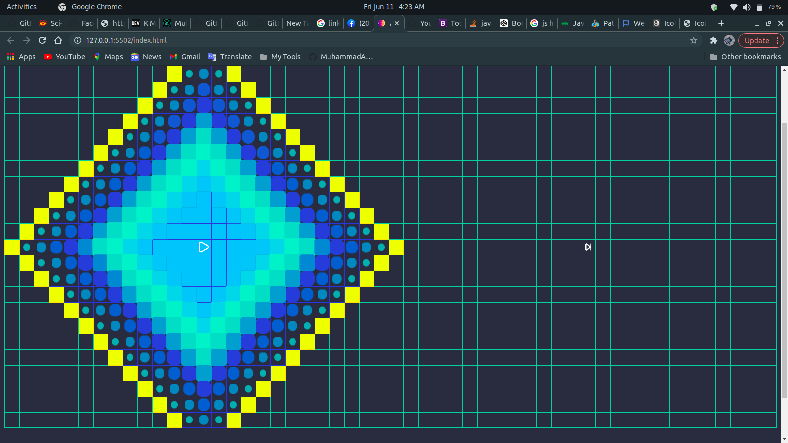

# Path Finding Algorithm Visualizer

A Path Finding Algorithm Visualizer that visualizes different types of path finding algorithms as well as simlple and complex maze generation algorithms.

## Features
 - change positions of source and destination Nodes
 - change the size of grid nodes
 - decide the speed for algorithms visualization
 - add walls and weights to nodes 
 - etc.....

 ## Algorithms

 - Path-finding algorithms
    - Depth-First-Search
    - Breadth-First-Search
    - A* using Manhattan Distance h(n)
    - Dijkstra (Uniform-Cost-Search variant)
    - Greedy-Best-First Search using Manhattan Distance